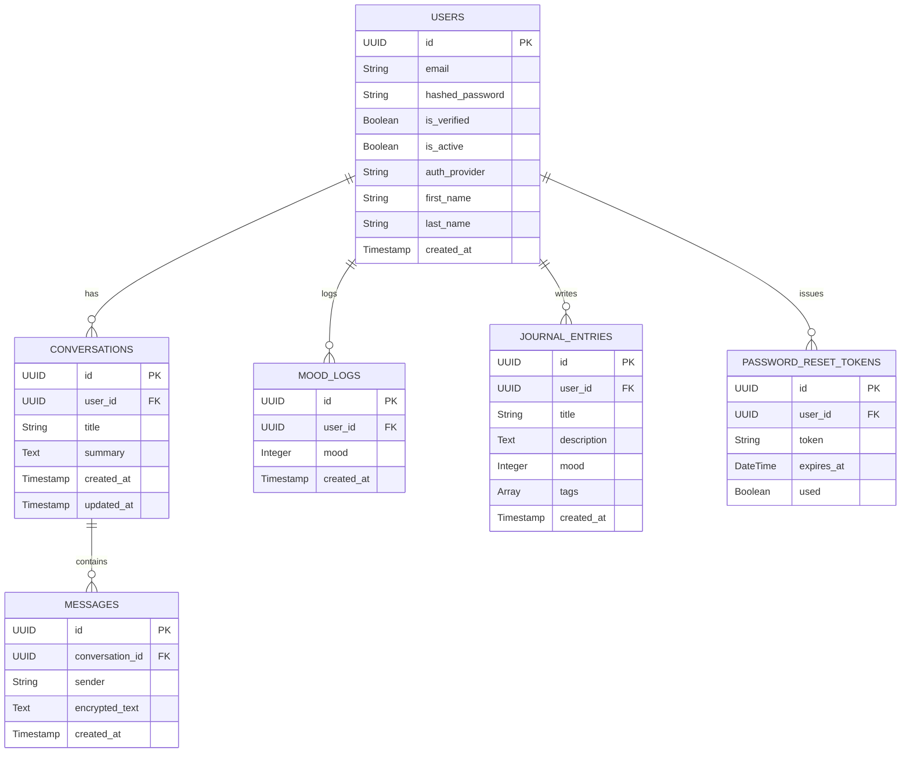
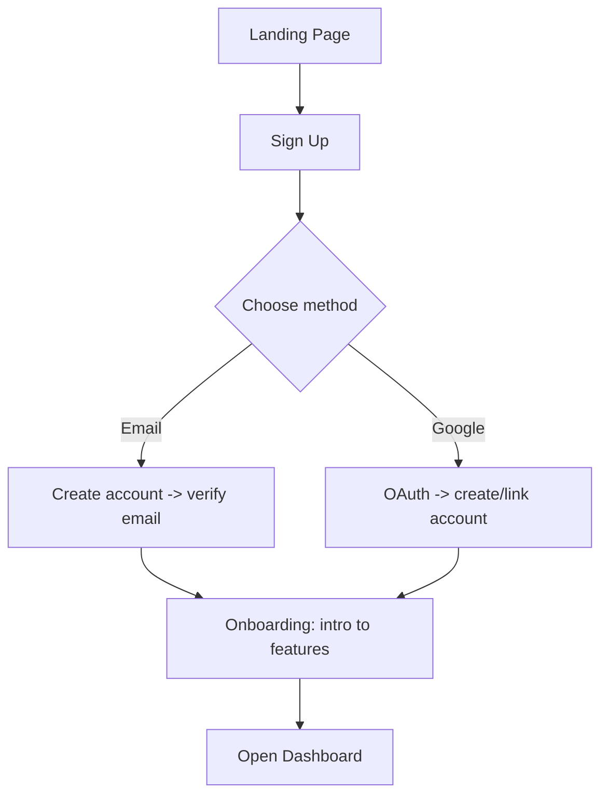
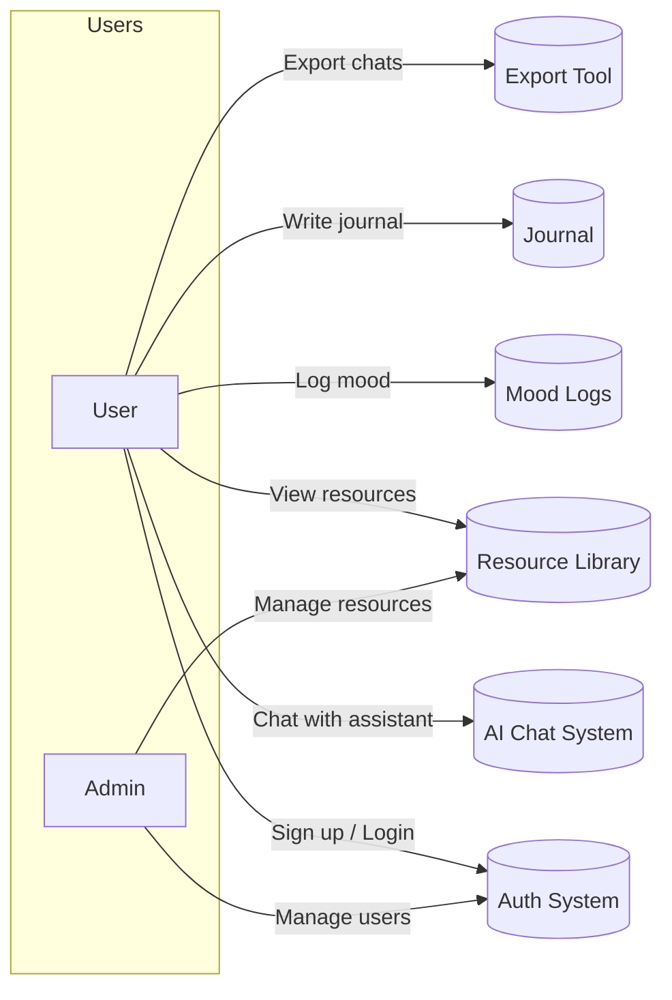

# MindMate — Project Documentation

**Project Name:** MindMate

**Short description:** MindMate is an AI-powered mental health companion web application that provides a private, secure chat-based assistant, mood logging, daily journaling, and curated mental-health resources. Chats are stored encrypted, users can export conversation data, and the assistant supports short-term conversation summaries (memory).

---

## Scope

**In scope (for this project evaluation):**
- AI-powered chatbot with conversation history.
- Encrypted storage for chat messages and export capability for user-owned data.
- Persistent conversation summaries (short memory) per conversation.
- Daily mood logging and journal entries with tags and mood association.
- Resource library (mental-health articles, helplines, guided meditations).
- Authentication (email + optional Google OAuth), JWT-based session management, refresh tokens.
- Admin/maintenance features (data export tools, user management) — minimal for evaluation.

**Out of scope (for MVP/hackathon version):**
- Real-time voice therapy or live sessions with humans.
- Clinical-grade medical diagnosis or prescriptions.
- Payments, subscriptions, or in-depth analytics dashboards.

---

## Tech Stack

- Frontend: React, Tailwind CSS, shadcn/ui
- Backend: FastAPI (Python)
- Database: PostgreSQL (SQLAlchemy ORM)
- Auth / Security: JWT, refresh tokens, encryption (e.g., Fernet / AES) for message storage
- Additional: Cyther (you wrote `cyther` — if you meant `cryptography` or `cypher`, replace accordingly), OAuth for Google link, Docker for containerization, Nginx for reverse proxy.

---

## ER Diagram (Mermaid)

---

## User Flow Diagrams (Mermaid flowcharts)

### 1) New user signup & onboarding

---

## Use Case Diagram (Mermaid)

---

## Database Dictionary

Below are the models you provided along with field descriptions and constraints.

### users
| Column | Type | Nullable | Default | Description |
|---|---:|---:|---:|---|
| id | UUID PK | No | uuid4 | Primary user identifier |
| email | String | No | - | Unique login email |
| hashed_password | String | Yes | - | Hashed password (nullable for OAuth accounts) |
| refresh_token | String | Yes | - | Server-side refresh token (optional storage) |
| is_verified | Boolean | No | False | Has user verified email |
| is_active | Boolean | No | True | Account active flag |
| auth_provider | String | No | "email" | e.g., email, google |
| is_google_linked | Boolean | No | False | Whether Google account is linked |
| first_name | String | Yes | - | Optional first name |
| last_name | String | Yes | - | Optional last name |
| created_at | TIMESTAMP | No | now | Account creation time |

### password_reset_tokens
| Column | Type | Nullable | Default | Description |
|---|---:|---:|---:|---|
| id | UUID PK | No | uuid4 | Token id |
| user_id | UUID FK -> users.id | No | - | Owner user |
| token | String | No | - | Token string used for reset |
| expires_at | DateTime | No | - | Expiration timestamp |
| used | Boolean | No | False | Whether token was used |

### conversations
| Column | Type | Nullable | Default | Description |
|---|---:|---:|---:|---|
| id | UUID PK | No | uuid4 | Conversation id |
| user_id | UUID FK -> users.id | Yes | - | Owner user |
| title | String | No | "New Chat" | User-settable title |
| summary | Text | Yes | - | Short stored memory/summary for context |
| created_at | TIMESTAMP | No | now | Creation time |
| updated_at | TIMESTAMP | No | now | Last update time |

### messages
| Column | Type | Nullable | Default | Description |
|---|---:|---:|---:|---|
| id | UUID PK | No | uuid4 | Message id |
| conversation_id | UUID FK -> conversations.id | Yes | - | Conversation owner |
| sender | String | Yes | - | 'user' or 'bot' |
| encrypted_text | Text | No | - | Encrypted message payload |
| created_at | TIMESTAMP | No | now | When message was created |

### mood_logs
| Column | Type | Nullable | Default | Description |
|---|---:|---:|---:|---|
| id | UUID PK | No | uuid4 | Mood log id |
| user_id | UUID FK -> users.id | No | - | Owner user |
| mood | Integer | No | - | Rating 1-5 |
| created_at | TIMESTAMP | No | now | Logged at |

### journal_entries
| Column | Type | Nullable | Default | Description |
|---|---:|---:|---:|---|
| id | UUID PK | No | uuid4 | Journal id |
| user_id | UUID FK -> users.id | No | - | Owner user |
| title | String | No | - | Journal title |
| description | Text | No | - | Entry body |
| mood | Integer | Yes | - | Optional mood associated |
| tags | ARRAY(String) | Yes | [] | Tag list |
| created_at | TIMESTAMP | No | now | Entry creation |

---

## Security & Privacy Notes

- **Encryption:** Use strong symmetric encryption (e.g., Fernet from cryptography or AES-GCM) for `encrypted_text`. Prefer client-side encryption for maximum privacy: store only ciphertext and let user hold key (or use a key-encryption-by-passphrase approach).
- **Key management:** If server performs encryption, use a secure KMS (HashiCorp Vault, AWS KMS) and rotate keys periodically. If client-side, provide secure recovery options and clearly inform users about responsibility for keys.
- **Authentication:** Use short-lived access JWT and refresh tokens. Store refresh tokens server-side or use rotating refresh tokens with revocation lists.
- **GDPR / Data export:** Implement `/export` endpoint that returns user-owned data in a machine-readable format (JSON/CSV). Authenticate and log export events.
- **Rate limits:** Protect AI endpoints to avoid abuse and cost overruns.
- **Content safety:** Add content moderation checks on user inputs (for suicidal ideation, self-harm). For high-risk content, include escalation: show crisis resources and encourage contacting professionals. **Explicitly do not** provide medical/legal/clinical diagnosis. Display disclaimers.

---

##  API endpoints 

- `POST /auth/signup` — create user
- `POST /auth/login` — returns access & refresh tokens
- `POST /auth/refresh` — refresh access token
- `POST /auth/google` — OAuth callback
- `GET /users/me` — profile
- `POST /password-reset/request` — send reset email
- `POST /password-reset/confirm` — complete reset

- `GET /conversations` — list user conversations
- `POST /conversations` — create conversation
- `GET /conversations/{id}` — fetch conversation metadata
- `POST /conversations/{id}/messages` — append encrypted message
- `GET /conversations/{id}/messages` — fetch (encrypted) messages
- `POST /conversations/{id}/export` — request export (requires auth)

- `POST /moods` — create MoodLog
- `GET /moods` — list mood logs

- `POST /journals` — create JournalEntry
- `GET /journals` — list journal entries

- `GET /resources` — list curated resources

---

---

